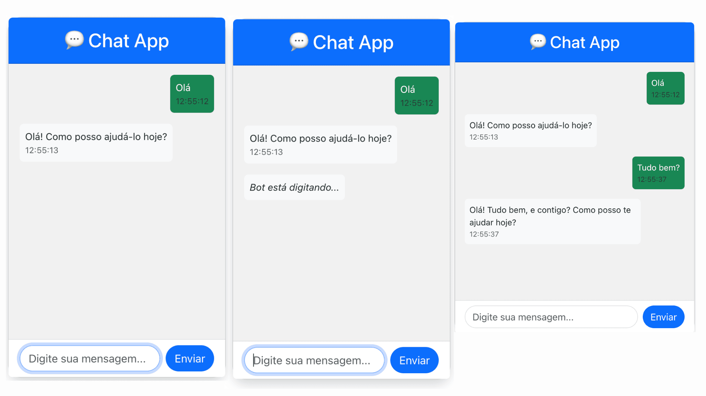

ChatApp — Fullstack WhatsApp Clone com Inteligência Artificial
Um projeto fullstack de chat que simula um WhatsApp simplificado, onde o usuário conversa com um bot de IA inteligente, integrado via Cohere AI.

---

  

---

🚀 Tecnologias Utilizadas
🔧 Backend
C# (.NET 8 Web API)

ASP.NET Core MVC

Integração com IA: Cohere API

Swagger para documentação da API (automático)

🎨 Frontend
React (com Vite)

Axios para comunicação HTTP

Bootstrap 5 para estilização responsiva

💡 Funcionalidades
📩 Envio de mensagens pelo chat.

🤖 Resposta automática via IA da Cohere.

📝 Validação de campos obrigatórios.

🔄 Atualização automática da lista de mensagens (Polling).

💬 Bot digitando... — simulação visual enquanto a IA responde.

🎨 Layout responsivo e clean, estilo WhatsApp.

🚀 Separação por MVC no Backend.

⚙️ Como rodar o projeto localmente

📦 Backend — ChatApp (.NET 8)
1. Clone o repositório:

2. Acesse a pasta do backend:

cd ChatApp

3. Adicione um arquivo appsettings.json:

{
  "Logging": {
    "LogLevel": {
      "Default": "Information",
      "Microsoft.AspNetCore": "Warning"
    }
  },
  "AllowedHosts": "*",
  "Cohere": {
    "ApiKey": "SUA_API_KEY_AQUI"
  }
}

4. Rode o backend:
dotnet run

O backend rodará em:
http://localhost:8000

📦 Frontend — chat-frontend (React + Vite)
1. Acesse a pasta do frontend:

cd chat-frontend

2. Instale as dependências:
npm install

3. Inicie o frontend:
npm run dev

O frontend estará disponível em:
http://localhost:5173

🌐 Configuração de Proxy (Frontend)
O Vite está configurado para redirecionar chamadas da API:
// vite.config.js
server: {
  proxy: {
    '/message': 'http://localhost:8000'
  }
}
Isso garante que o Frontend possa fazer requisições para o Backend sem problemas de CORS durante o desenvolvimento.

📚 Documentação da API
GET /message → Retorna todas as mensagens.

POST /message → Envia uma nova mensagem (o bot responderá automaticamente).

A documentação Swagger é gerada automaticamente em:
http://localhost:8000/swagger
🧠 Sobre a IA — Cohere Integration

Este projeto utiliza a API de Chat da Cohere:

Endpoint: https://api.cohere.ai/v1/chat

Fluxo:

Usuário envia mensagem.
Backend salva a mensagem.
Backend chama a API da Cohere para gerar a resposta.
Backend salva a resposta como mensagem do bot.
Frontend atualiza automaticamente a lista de mensagens.